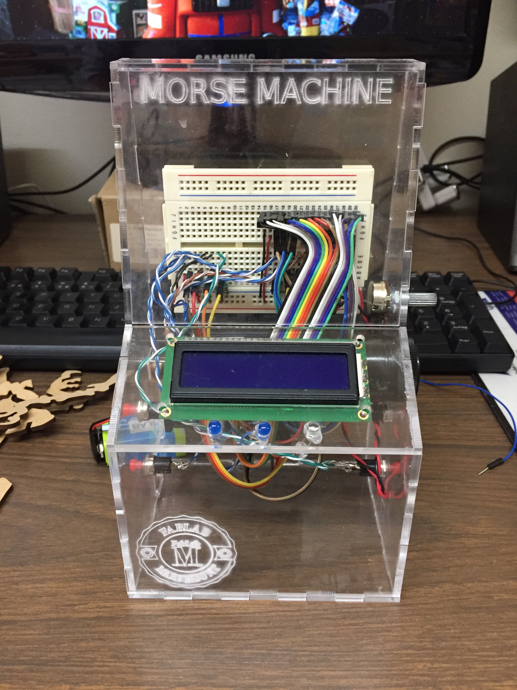

# MORSE MACHINE WITH ARDUINO

#

This is a simple project to apply the knowledge about arduino and the development of movil applications with App Inventor from MIT for doing a funny and a simple movil robot controlled by a running application on the cell phone and throughout Bluetooth

(Este es un projecto simple realizado con el propósito de aplicar el conocimiento de Arduino y el desarrollo de aplicaciones móviles con App Invertor del MIT para realizar un robót móvil muy sencillo que pueda ser controlado por medio de una aplicación ejecutándose en el celular y a través de bluetooth)

